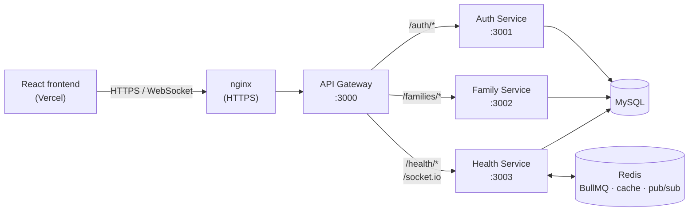

# FamilyCare — Backend

Backend for **FamilyCare**, a family medication dashboard. Family members share
one space where they add the people they care for, track their medications,
mark doses as taken, and get **real-time reminders and updates** on every
family member's screen.

The backend is a set of small **Node.js / Express microservices** behind an
**API gateway**, with **MySQL** for data, **Redis + BullMQ** for scheduled
medication reminders, and **Socket.IO** for live updates.

> Frontend: [FamilyCareFrontend](https://github.com/Subhajit7710/FamilyCareFrontend) (React + Vite)
> Deployment guide: [DEPLOY.md](DEPLOY.md)

---

## Features

- **Accounts** — register / log in with email and password (bcrypt-hashed), JWT sessions (24 h).
- **Families** — create a family, invite others with a short family code, list members and roles (admin / member).
- **Patients** — profiles for each person being cared for (age, conditions), grouped by family.
- **Medications** — add medications with dosage, time and frequency; list and view history.
- **"Mark as taken"** — logs the dose and instantly notifies everyone in the family.
- **Scheduled reminders** — BullMQ jobs fire daily at each medication's time and push a reminder to the family in real time.
- **Drug information** — looks up a drug on the public [OpenFDA](https://open.fda.gov/) API (purpose, warnings, dosage, side effects), cached in Redis for 24 h.

## Architecture



| Service | Port | Responsibility |
|---|---|---|
| **api-gateway** | 3000 | Single entry point. Proxies REST calls and Socket.IO to the right service, handles CORS. |
| **auth-service** | 3001 | Registration, login, JWT issuing, user profile. |
| **family-service** | 3002 | Families, invite codes, membership. |
| **health-service** | 3003 | Patients, medications, dose logs, OpenFDA lookup, BullMQ reminder queue, Socket.IO server. |
| MySQL 8 (Docker) | 3307 → 3306 | Shared database `familycare`. Tables are created automatically on start (`sequelize.sync`). |
| Redis 7 (Docker) | 6379 | BullMQ queue, drug-info cache, pub/sub between services. |

All services share the same `JWT_SECRET`, so a token issued by the auth service
is accepted by every service.

## Tech stack

Node.js 20+ · Express 5 · Sequelize (MySQL) · Redis / ioredis · BullMQ ·
Socket.IO · http-proxy-middleware · JWT · bcrypt · Helmet · Docker Compose ·
pm2 + nginx (production)

## Project structure

```
.
├── api-gateway/          # Express gateway (proxy + CORS + socket.io upgrade)
├── auth-service/         # users, login, JWT
├── family-service/       # families, invites, members
├── health-service/
│   ├── config/           # database.js, redis.js
│   ├── controllers/      # patients, medications, drug info
│   ├── models/           # Patient, Medication, MedicationLog
│   ├── queues/           # BullMQ reminder queue + Bull Board
│   └── socket/           # Socket.IO server (auth, family rooms, pub/sub)
├── deploy/
│   ├── setup-server.sh   # one-command production setup (Ubuntu)
│   ├── update.sh         # pull + restart after a new push
│   └── nginx-familycare.conf.template
├── docker-compose.yml    # MySQL + Redis
├── ecosystem.config.js   # pm2 process file (production)
├── start-all.sh          # start everything locally (bash)
└── DEPLOY.md             # step-by-step deployment guide
```

---

## Running locally

### Prerequisites

- [Node.js](https://nodejs.org/) 20 or newer
- [Docker Desktop](https://www.docker.com/products/docker-desktop/) (for MySQL and Redis)

### 1. Start MySQL and Redis

```bash
docker compose up -d mysql redis
```

MySQL is available on `127.0.0.1:3307`, Redis on `127.0.0.1:6379`.
Passwords default to the development values in `docker-compose.yml`; to use your
own, copy `.env.example` to `.env` in the project root and edit it **before the
first start** (MySQL only reads them when it creates its data volume).

### 2. Create the `.env` files

Each service has a `.env.example`. Copy it to `.env` in the same folder:

```bash
# macOS / Linux / Git Bash
for s in api-gateway auth-service family-service health-service; do cp $s/.env.example $s/.env; done
```

```powershell
# Windows PowerShell
foreach ($s in "api-gateway","auth-service","family-service","health-service") { Copy-Item "$s\.env.example" "$s\.env" }
```

Then edit them:

- `JWT_SECRET` — any long random string, **identical in all four files**.
- `DB_USER` / `DB_PASSWORD` — must match MySQL (defaults: `user` / `familycare_12345678`).

### 3. Install and run

In four terminals (or run `bash start-all.sh` on macOS/Linux/Git Bash):

```bash
cd auth-service   && npm install && npm run dev
cd family-service && npm install && npm run dev
cd health-service && npm install && npm run dev
cd api-gateway    && npm install && npm run dev
```

Check that everything is up:

```bash
curl http://localhost:3000/gateway/status
# {"success":true,"status":{"auth":"healthy","family":"healthy","health":"healthy"}}
```

Point the frontend at `http://localhost:3000` (`VITE_API_URL`).

## Configuration

| Variable | Used by | Description |
|---|---|---|
| `PORT` | all | Port the service listens on (3000–3003). |
| `HOST` | all | Optional bind address. Production uses `127.0.0.1` so only nginx can reach the services. |
| `JWT_SECRET` | all | Secret for signing/verifying JWTs. Must be the same everywhere. |
| `DB_HOST`, `DB_PORT`, `DB_USER`, `DB_PASSWORD`, `DB_NAME` | auth, family, health | MySQL connection. |
| `REDIS_URL` | health | e.g. `redis://127.0.0.1:6379`. |
| `AUTH_SERVICE_URL`, `FAMILY_SERVICE_URL`, `HEALTH_SERVICE_URL` | gateway | Where the gateway forwards requests (default `http://localhost:300x`). |
| `ALLOWED_ORIGINS` | gateway | Comma-separated frontend URLs allowed by CORS, or `*` for any. |
| `FRONTEND_URL` | family | Base URL used to build invite links. |

`.env` files are git-ignored. Never commit real secrets.

---

## API reference

All requests go through the gateway (`http://localhost:3000` locally, your
HTTPS domain in production). Send JSON, and for protected routes add:

```
Authorization: Bearer <token>
```

### Auth — `/auth`

| Method | Path | Auth | Body / notes |
|---|---|---|---|
| POST | `/auth/register` | – | `{ name, email, password }` → `{ token, user }` |
| POST | `/auth/login` | – | `{ email, password }` → `{ token, user }` (`user.familyId` if in a family) |
| GET | `/auth/profile` | ✔ | Current user (+ `familyId`) |

### Families — `/families`

| Method | Path | Auth | Body / notes |
|---|---|---|---|
| POST | `/families` | ✔ | `{ name }` → creates the family, caller becomes **admin**; returns `familyCode` |
| GET | `/families/:id` | ✔ | Family details with members (members only) |
| GET | `/families/:id/members` | ✔ | `[{ id, name, email, role, joinedAt }]` |
| POST | `/families/:id/invite` | ✔ admin | Returns `inviteCode` and `inviteLink` |
| POST | `/families/join` | ✔ | `{ inviteCode }` → joins as **member** |

### Health — `/health`

| Method | Path | Auth | Body / notes |
|---|---|---|---|
| POST | `/health/patients` | ✔ | `{ name, age?, conditions?, familyId }` |
| GET | `/health/patients/:id` | ✔ | Patient with active medications (looked up by user id, then patient id; a profile is created if missing) |
| PUT | `/health/patients/:id` | ✔ | `{ name?, age?, conditions? }` |
| DELETE | `/health/patients/:id` | ✔ | |
| GET | `/health/families/:familyId/patients` | ✔ | All patients in a family, with active medications |
| POST | `/health/medications` | ✔ | `{ patientId, name, dosage?, schedule: "HH:MM", frequency? }` — also schedules the daily reminder |
| GET | `/health/patients/:patientId/medications` | ✔ | Medications for a patient |
| POST | `/health/medications/:id/taken` | ✔ | Logs a dose and notifies the family in real time |
| GET | `/health/patients/:patientId/history?days=7` | ✔ | Dose log for the last *n* days |
| GET | `/health/drug-info/:name` | ✔ | OpenFDA lookup (cached 24 h) |

### Status

| Method | Path | Description |
|---|---|---|
| GET | `/gateway/health` | Gateway is up |
| GET | `/gateway/status` | Health of auth, family and health services |

### Example

```bash
# Register
curl -X POST http://localhost:3000/auth/register \
  -H "Content-Type: application/json" \
  -d '{"name":"Asha","email":"asha@example.com","password":"secret123"}'

# Use the returned token
TOKEN=...
curl -X POST http://localhost:3000/families \
  -H "Authorization: Bearer $TOKEN" -H "Content-Type: application/json" \
  -d '{"name":"Sharma Family"}'
```

## Real-time events (Socket.IO)

Connect to the gateway URL with the JWT:

```js
import { io } from "socket.io-client";
const socket = io(API_URL, { auth: { token } });
socket.on("connect", () => socket.emit("join-family", familyId));
```

| Direction | Event | Payload / meaning |
|---|---|---|
| client → server | `join-family` | `familyId` — join the family's room |
| client → server | `leave-family` | `familyId` |
| server → client | `medication-reminder` | A scheduled dose is due: `{ medicationName, patientName, scheduledTime, … }` |
| server → client | `medication-taken` | Someone marked a dose as taken: `{ medicationName, patientName, takenBy, time, … }` |
| server → client | `user-online` / `user-offline` | `{ userId, timestamp }` |
| server → client | `family-update` | General family update (via Redis pub/sub) |

## Medication reminders

When a medication is added (and for all active medications on startup), the
health service adds a **repeating BullMQ job** that runs every day at the
medication's `schedule` time. The worker emits `medication-reminder` to the
family's Socket.IO room. Times use the **server's timezone** — the production
setup sets it to `Asia/Kolkata`.

A queue dashboard (Bull Board) is served by the health service at
`http://localhost:3003/admin/queues`. It is not exposed through the gateway.

---

## Deployment

Production runs on a single Ubuntu server: MySQL and Redis in Docker, the four
services under **pm2**, **nginx** in front with a free **Let's Encrypt**
certificate. One script does the whole setup:

```bash
git clone https://github.com/Subhajit7710/FamilyCareBackend.git
cd FamilyCareBackend
bash deploy/setup-server.sh <your-domain> <your-email> [frontend-url]
```

It generates strong passwords and the JWT secret, writes all `.env` files,
starts everything, and enables HTTPS. To update after pushing new code:

```bash
bash deploy/update.sh
```

See **[DEPLOY.md](DEPLOY.md)** for the full step-by-step guide (AWS EC2 + Vercel).

## Security notes

- Passwords are hashed with bcrypt; JWTs expire after 24 hours.
- In production only ports 22, 80 and 443 are open; services and databases listen on `127.0.0.1`.
- CORS can be limited to your frontend with `ALLOWED_ORIGINS`.
- Secrets live only in `.env` files, which are never committed.
